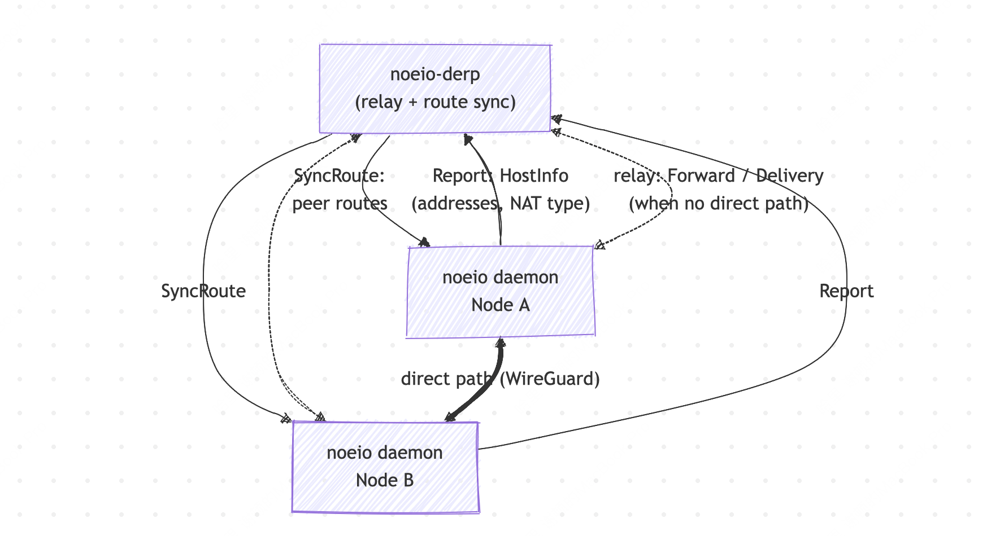

# Noeio Core


[English](README.md) | 简体中文

Noeio 是一个可私有化部署、节点无状态且轻量的三层（Layer-3）Mesh 组网系统。它通过虚拟网卡将分布在不同局域网、NAT 之后和云上的机器连成一个私有网络。所有数据面组件都运行在你自己的基础设施上，不依赖任何第三方协调服务。

## 特性

- **三层虚拟网卡** —— 节点通过本地 `noeio0` 接口加入私有子网，任意 IP 流量开箱即用
- **WireGuard 加密数据面** —— 任意两节点之间都有一条独立密钥的专属隧道，基于 boringtun
- **NAT 穿透** —— 基于 STUN 的地址发现与 UDP 打洞，跨 NAT 建立直连
- **最低延迟选路** —— 对每条候选路径（局域网与公网）做 ping/pong RTT 探测，流量始终走最快的一条，切换带防抖
- **自部署中继兜底** —— 无直连路径时回退到你自己的 derper 中继，由网络级 token 认证保护
- **跨平台** —— 支持 Linux、macOS 和 Windows

## 初衷

我正是在使用 [Tailscale](https://github.com/tailscale/tailscale) 之后，发现它功能强大且极其好用。出于学习的目的，我去了解了它的底层实现原理，发现恰好与我当时正在学习的 Kubernetes CNI 组件有相似之处。于是，为了更好地学习和补充网络知识，我决定自己动手写一个 Overlay Network。我知道这个项目不一定能比肩 Tailscale，但光是这个学习的过程就已让我收获颇丰。我希望把它作为我的学习成果分享出来，以向社区分享和讨论更多知识与有趣的想法。另外也受到 Sandbox 这种产品形态的启发，让我决定将 Noeio 的节点设计成一种无状态的方式，以符合 Sandbox 的生命周期。

## 与 Tailscale 的区别

Noeio 是一个纯数据面组件：只负责组网本身，不内置 Tailscale 那样的账户、身份认证和 ACL 体系。这使它非常适合私有化部署。如果需要支持多租户，则需在其之上搭配你自己的控制面。

此外，Noeio 的节点天然是无状态、非持久注册的（Tailscale 的节点在未开启 Ephemeral 时是有状态且持久注册的）。这让 Noeio 节点非常轻量，可以随时部署和释放，因此对 Sandbox 这类使用场景非常友好。

## 架构



每个节点运行一个 noeio daemon，向自部署的 derper 上报自己的地址和 NAT 类型；derper 通过 SyncRoute 把各节点的路径候选广播回去。节点间的流量在存在直连路径时走 WireGuard 加密的直连，否则回退到经 derper 中继转发。

## 安装

前置条件：[Rust 工具链](https://rustup.rs/) 和 `protoc`（protobuf 编译器）——Linux 用 `apt install protobuf-compiler`，macOS 用 `brew install protobuf`；Windows 可用 `choco install protoc` / `scoop install protobuf`，或从 [protobuf releases](https://github.com/protocolbuffers/protobuf/releases) 下载 `protoc-*-win64.zip` 并加入 `PATH`。二进制由 cargo 在本机编译，因此任意平台均适用。

### derper

derper 需要部署在一台所有节点都能访问到的机器上，一般是一台带公网 IP 的云厂商机器：

```bash
cargo install --git https://github.com/CeerDecy/noeio-core noeio-derp
```

### noeio

在每个需要加入虚拟网络的节点上安装 noeio daemon：

```bash
cargo install --git https://github.com/CeerDecy/noeio-core noeio
```

## 快速开始

1. 启动 derper 中继。derper 需要部署在一台所有节点都能访问到的机器上，一般是一台带公网 IP 的云厂商机器。

   Docker 方式：

   ```bash
   docker run -d --name noeio-derper -p 8080:8080/udp --rm registry.cn-hangzhou.aliyuncs.com/noeio/noeio-derp:202608112151-7b767cd
   ```

   或二进制方式：

   ```bash
   cargo install --git https://github.com/CeerDecy/noeio-core noeio-derp && noeio-derp boot
   ```

2. 生成 derper 认证 token。`--network` 是一个用于标识虚拟网络的 UUID，可以根据自己的需要随意填写其他 UUID；持有同一 UUID token 的节点会加入同一个虚拟网络。

   Docker 方式：

   ```bash
   docker exec noeio-derper /usr/local/bin/noeio-derp token create --network 25fe8468-b310-43ed-96be-495641eececd --ttl 0
   ```

   或二进制方式：

   ```bash
   noeio-derp token create --network 25fe8468-b310-43ed-96be-495641eececd --ttl 0
   ```

3. 在每个需要加入虚拟网络的节点上，更新 `~/.noeio/config.toml`——注意将 `address` 替换为你自己的 derper 地址，将 `token` 替换为第二步生成的 token。可以参考项目根目录下的 [`config.toml.example`](config.toml.example)：

   ```toml
   [stun]
   servers = ["stun.chat.bilibili.com:3478"] # 换成离你较近的 STUN 服务器

   [[derper.servers]]
   address = "192.168.0.1:8080" # 换成你自己的 derper 地址
   token = "<填入第二步生成的 token>"
   ```

4. 启动 noeio daemon（仅提供二进制方式）：

   ```bash
   noeio boot
   ```

   > 非 Linux 宿主机不建议用 Docker 运行 noeio 本体：每个操作系统的虚拟网卡创建方式不同，默认 Docker 镜像提供的是 Linux 的部署。

5. 创建虚拟网卡并加入网络。`--ip` 可以自定义，建议使用 `100.64.0.0/10` 网段，同一个网络下每个节点的 IP 不能相同。`--network` 需要与第二步命令中的 network 参数保持一致。

   节点 A 上执行：

   ```bash
   noeio create vnic --ip 100.64.0.1 --network 25fe8468-b310-43ed-96be-495641eececd
   ```

   节点 B 上执行：

   ```bash
   noeio create vnic --ip 100.64.0.2 --network 25fe8468-b310-43ed-96be-495641eececd
   ```

6. 在节点 A 上通过虚拟网络 ping 节点 B：

   ```bash
   ping 100.64.0.2
   ```

   ```text
   64 bytes from 100.64.0.2: icmp_seq=1 ttl=64 time=34.155 ms
   64 bytes from 100.64.0.2: icmp_seq=2 ttl=64 time=28.900 ms
   64 bytes from 100.64.0.2: icmp_seq=3 ttl=64 time=23.171 ms
   64 bytes from 100.64.0.2: icmp_seq=4 ttl=64 time=31.013 ms
   64 bytes from 100.64.0.2: icmp_seq=5 ttl=64 time=26.343 ms
   64 bytes from 100.64.0.2: icmp_seq=6 ttl=64 time=29.072 ms
   64 bytes from 100.64.0.2: icmp_seq=7 ttl=64 time=22.765 ms
   ```

   ping 通即表示两个节点已经连上，组网完成。

## 构建

构建 derper 二进制：

```bash
cargo build --release -p noeio-derp
```

或构建多平台 Docker 镜像并推送：

```bash
REGISTRY=<your image registry url> MODEL=noeio-derp make build
```

构建 noeio daemon 二进制：

```bash
cargo build --release -p noeio
```

## Roadmap

- [ ] `NoeioPacket` 的零拷贝改造
- [ ] 子路由支持
- [ ] 多虚拟网络支持

## License

本项目基于 [Apache License 2.0](LICENSE) 开源。
